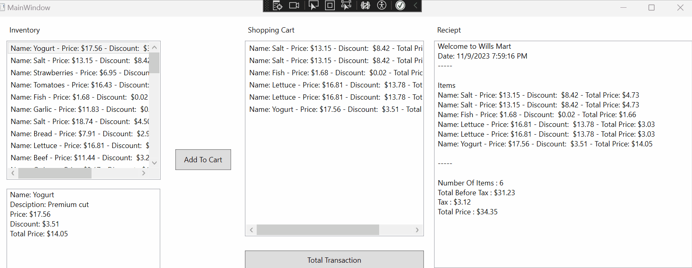
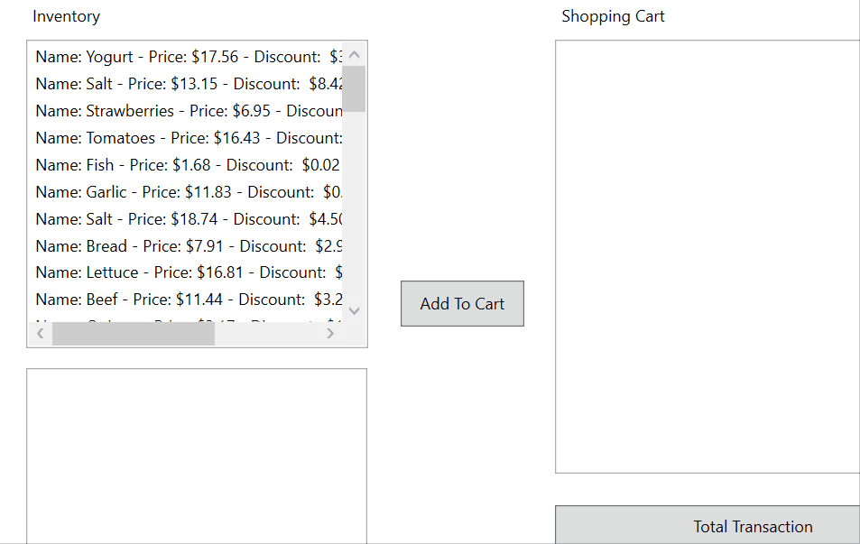

# GA_Classes

This assignment will walk you through creating classes ( including explinations about fields, constructors, properties, and methods ). 

You will then add items to a List to replicate a inventory. 

Following this you will create another class that will recplicate an online shopping cart that will hold items you wish to purchase. 

Followed by totaling up the cost and displaying everything as a formatted receipt.



***Full Step By Step***

1. [Step1 Setting Up](Steps/Step1_SettingUp.md)  
2. [Step2 Item Class](Steps/Step2_ItemClass.md)  
3. [Step3 Displaying A List Of Item](Steps/Step3_DisplayingAListOfItem.md)  
4. [Step4 Shopping Cart Class](Steps/Step4_ShoppingCartClass.md)  
5. [Step5 Displaying Our Reciept](Steps/Step5_DisplayingOurReciept.md)  

---

### Below are the steps needed to complete the assignment if you didn't want to go thorugh the Step By Step process.

---
## [Step1 Setting Up](Steps/Step1_SettingUp.md)
1. Create a WPF appliation with the name of GA_***YourName***_Classes
2. Replace `<Grid>` with our new xaml code (Located Below). And double click on the 2 buttons and `lbInventor` to create events. 

---
## [Step2 Item Class](Steps/Step2_ItemClass.md)
1. Create a class called `Item`
    * Give it 4 [fields](Information/Fields.md)
        1. `string _name` <--- This is for the name of the item
        2. `string _desciption` <---- Discription of the item
        3. `double _price` <--------
        4. `double _discount` <------
    * Create 2 [Constructors](Information/Constructor.md).
        1. One that takes all fields as arguments
        2. One that takes only a name and a price.  
            **Set description to an empty string, and discount to 0**
    * Create [Properties](Information/Properties.md) for all 4 fields
        1. Get and Set for `Name`, `Description`, `Price`, and `Discount`
            * Validate the `Price` to make sure its above 0
            * Validate the `Discount` to make sure its above 0 and below 1. ( You wouldn't want someone to have a discount of 150%)
    * Create 2 [Methods](Information/Methods.md)
        1. `public double DiscountedAmount()`
            * This should return the the the dollar amount of the discount
            * Ex : If the amount is 10, and the discount is .1 ( 10% ) then the method should return 1 ( 1 dollar )
        2. `public double CaculateTotalPrice()`
            * This should return the price minus the DiscountedAmount();
            
    * Override the [ToString()](Information/OverrideToString.md)  
        * This should display the name, price, Discount, and Total Price
        * Ex:  Name: Granny Smith - Price: $1.50 - Discount: $0.15 - Total Price: $1.35  
        * Make sure to use `.ToString("c");` on your prices to format it to currency
   
---
## [Step3 Displaying A List Of Item](Steps/Step3_DisplayingAListOfItem.md)
`MainWindow.xaml.cs`

1. Create a global `List<Item> inventory`.
2. Copy and paste the included `PreloadInventory()` method.
3. In your `MainWindow()` method call the `PreloadInventory()` method.
4. Assign your inventory list the the `lbInventory.ItemsSource`.
5. In your `lbInventory_SelectionChange` event, have the information about the item appear in the `rtbItemDescription` appear.



---
## [Step4 Shopping Cart Class](Steps/Step4_ShoppingCartClass.md)

1. Create a new `ShoppingCart` class.
    1. Fields
        * `string _storeName;`
        * `List<Item> _itemsInCart;`
        * `double _tax;`
    2. Constructor
        * Takes one parameter, `string storeName`
        * Initialize list in constructor, `_itemsInCart = new List<Item>();`
        * Tax should be set to .1. `_tax = .1;`
    3. Properties
        * `string StoreName {get; set;}`
        * `double ItemsInCart {get; }`
        * `double Tax {get; }`
    4. Methods
        * `AddItem(Item item)` - Add item to shopping cart
        * `TotalBeforeTax()` - Sum all items in cart.CalculateTotalPrice(), return sum.
        * `TaxOnTotal()` - Return `TotalBeforeTax() * Tax`
        * `TotalPrice()` - Return `TotalBeforeTax() + TaxOnTotal()`
        * `Reciept()` - Return a formatted string of a reciept.

        `Example`
        > Welcome to Wills Mart  
        > Date: 11/9/2023 8:25:41 PM  
        > \-----   
        > Items  // Should display All items in the cart
        > Name: Bread - Price: $7.91 - Discount:  $2.93 - Total Price: $4.98  
        > Name: Tomatoes - Price: $16.43 - Discount:  $9.37 - Total Price: $7.06  
        > \-----  
        > Number Of Items : 2  
        > Total Before Tax : $12.05  
        > Tax : $1.20  
        > Total Price : $13.25  

---
## [Step5 Displaying Our Reciept](Steps/Step5_DisplayingOurReciept.md)

1. In your `btnAddToCart_Click` event, when the user selects an item and clicks "Add To Cart", the item shows up in the shopping cart. It refreshes to show the new item.  
    1. `lbShopping.Items.Refresh()` used to refresh cart. Put at end of method.
2. In your `btnTotalTransaction_Click`, call the `cart.Reciept()` and assign the string the `rtbReciept.Text` property.

---

# Final Result


---

Start Xaml Code
```html
    <Canvas>
        <ListBox x:Name="lbInventory" Height="228" Width="253" d:ItemsSource="{d:SampleData ItemCount=5}" Canvas.Left="25" Canvas.Top="39" HorizontalAlignment="Left" VerticalAlignment="Center" />
        <RichTextBox Height="132" Width="252" Canvas.Left="25" Canvas.Top="282" HorizontalAlignment="Left" VerticalAlignment="Center">
            <FlowDocument>
                <Paragraph>
                    <Run x:Name="rtbItemDescription"/>
                </Paragraph>
            </FlowDocument>
        </RichTextBox>
        <Label Content="Inventory" Canvas.Left="25" Canvas.Top="8"/>
        <Button x:Name="btnAddToCart" Content="Add To Cart" Canvas.Left="302" Canvas.Top="217" Height="34" Width="91" HorizontalAlignment="Left" VerticalAlignment="Center" />
        <ListBox x:Name="lbShopping" Height="321" Width="293" d:ItemsSource="{d:SampleData ItemCount=5}" Canvas.Left="416" Canvas.Top="39" HorizontalAlignment="Center" VerticalAlignment="Top"/>
        <RichTextBox Height="373" Width="423" Canvas.Left="726" Canvas.Top="39" HorizontalAlignment="Left" VerticalAlignment="Center">
            <FlowDocument>
                <Paragraph>
                    <Run x:Name="rtbReciept" />
                </Paragraph>
            </FlowDocument>
        </RichTextBox>
        <Label Content="Shopping Cart" Canvas.Left="416" Canvas.Top="8" HorizontalAlignment="Left" VerticalAlignment="Center"/>
        <Label Content="Reciept" Canvas.Left="726" Canvas.Top="8" HorizontalAlignment="Left" VerticalAlignment="Center"/>
        <Button x:Name="btnTotalTransaction" Content="Total Transaction" Canvas.Left="416" Canvas.Top="383" HorizontalAlignment="Center" VerticalAlignment="Top" Width="293" Height="31"  />

    </Canvas>

```


`Preload method`
```csharp
        public void PreloadInventory()
        {
            inventory = new List<Item>
        {
            new Item("Yogurt", "Premium cut", 17.56, 0.2),
            new Item("Salt", "Soothing blend", 13.15, 0.64),
            new Item("Strawberries", "Crisp and fresh", 6.95, 0.18),
            new Item("Tomatoes", "Local farm product", 16.43, 0.57),
            new Item("Fish", "Starchy and filling", 1.68, 0.01),
            new Item("Garlic", "Freshwater", 11.83, 0.08),
            new Item("Salt", "Balsamic", 18.74, 0.24),
            new Item("Bread", "Lean and healthy", 7.91, 0.37),
            new Item("Lettuce", "Ripe and juicy", 16.81, 0.82),
            new Item("Beef", "Vitamin-rich", 11.44, 0.28),
            new Item("Quinoa", "Free-range", 3.17, 0.53),
            new Item("Tofu", "Spicy and colorful", 13.63, 0.44),
            new Item("Herbs", "Steel-cut", 3.23, 0.78),
            new Item("Bread", "Vitamin-rich", 16.96, 0.7),
            new Item("Soda", "High-protein", 1.71, 0.56),
            new Item("Peppers", "Balsamic", 11.93, 0.05),
            new Item("Chicken", "Lean and healthy", 12.11, 0.54),
            new Item("Quinoa", "Low-calorie", 9.26, 0.16),
            new Item("Beef", "Organic and fresh", 4.27, 0.29),
            new Item("Cheese", "Seedless variety", 7.94, 0.35),
            new Item("Soda", "Seedless variety", 2.11, 0.22),
            new Item("Olive Oil", "Fruit spread", 8.35, 0.36),
            new Item("Oats", "Crunchy snack", 3.56, 0.08),
            new Item("Ginger", "Zesty", 4.71, 0.71),
            new Item("Bread", "Crisp and fresh", 10.76, 0.5),
            new Item("Nuts", "Fruit spread", 8.76, 0.97),
            new Item("Peppers", "Grass-fed beef", 15.47, 0.78),
            new Item("Tofu", "Sugar-free", 10.21, 0.72),
            new Item("Nuts", "Local farm product", 16.03, 0.42),
            new Item("Vinegar", "Maple-flavored", 11.46, 0.35),
            new Item("Potatoes", "Freshly ground", 13.6, 0.77),
            new Item("Oats", "Grass-fed beef", 10.05, 0.71),
            new Item("Coffee", "Sweet treat", 6.92, 0.08),
            new Item("Chocolate", "Assorted herbs", 3.88, 0.9),
            new Item("Candy", "Sugar-free", 1.04, 0.8),
            new Item("Soda", "Juicy and flavorful", 6.42, 0.93),
            new Item("Pasta", "Premium cut", 10.34, 0.48),
            new Item("Jam", "Crunchy snack", 7.38, 0.51),
            new Item("Beef", "100% natural", 5.52, 0.68),
            new Item("Chocolate", "Fresh and tasty", 13.71, 0.32),
            new Item("Butter", "Vitamin-rich", 8.63, 0.3),
            new Item("Ketchup", "Full of flavor", 17.83, 0.97),
            new Item("Banana", "Crunchy snack", 8.8, 0.49),
            new Item("Herbs", "Extra virgin", 17.56, 0.14),
            new Item("Pepper", "Full of flavor", 13.66, 1.0),
            new Item("Water", "Steel-cut", 2.0, 1.0),
            new Item("Pepper", "Sweet and crunchy", 13.68, 0.58),
            new Item("Cheese", "Seedless variety", 4.03, 0.87),
            new Item("Tea", "Full of flavor", 9.9, 0.72),
            new Item("Grapes", "Sweet treat", 19.73, 0.05)
        };
        } // PreloadInventory()
```


---
# Final Code

`Item.cs`

```csharp
    public class Item
    {

        // Fields
        string _name;
        string _description;
        double _price;
        double _discount;

        // Constructor
        public Item(string name, string description, double price, double discount)
        {
            _name = name;
            _description = description;
            _price = price;
            _discount = discount;
        } // Item

        public Item(string name, double price)
        {
            _name = name;
            _price = price;
            _discount = 0;
            _description = "";
        } // Item


        // Properties
        public string Name
        {
            get
            {
                return _name;
            }
            set
            {
                _name = value;
            }
        } // Name

        public string Description
        {
            get
            {
                return _description;
            }
            set
            {
                _description = value;
            }
        } // Decription

        public double Price
        {
            get
            {
                return _price;
            }
            set
            {
                // Validating that Value is not a negative 
                if(value >= 0)
                {
                    _price = value;
                }
            }
        } // Price

        public double Discount
        {
            get { return _discount; }
            set
            {
                // Validating that the value is not negative or over 100 percent
                if(value >= 0 && value <= 1)
                {
                    _discount = value;
                }
            }
        } // Discount


        public double DiscountedAmount()
        {
            return Price * Discount;
        } // DiscountedAmount()

        public double CaculateTotalPrice()
        {
            return Price - DiscountedAmount();
        } // CalculateTotalPrice()

        public override string ToString()
        {
            return $"Name: {_name} - Price: {_price.ToString("c")} - Discount:  {_discount.ToString("c")} - Total Price: {_price.ToString("c")}";
        } // ToString()


    } // class
```

`ShoppingCart.cs`
```csharp
    public class ShoppingCart
    {
        string _storeName;
        List<Item> _itemsInCart;
        double _tax;

        public ShoppingCart(string storeName)
        {
            _storeName = storeName;
            _itemsInCart = new List<Item>();
            _tax = .1;
        } // ShoppingCart()


        public void AddItem(Item item)
        {
            _itemsInCart.Add(item);
        } // 

        public string StoreName
        {
            get => _storeName;
            set => _storeName = value;
        } // StoreName

        
        public List<Item> ItemsInCart
        {
            get
            {
                return _itemsInCart;
            }
        }

        public double Tax
        {
            get => _tax;
        } // Tax

        public double TotalBeforeTax()
        {
            double sum = 0;
            foreach (Item item in _itemsInCart)
            {
                sum += item.Price;
            }

            return sum;
        } // TotalBeforeTax()

        public double TaxOnTotal()
        {
            return TotalBeforeTax() * _tax;
        } // TaxOnTotal()

        public double TotalPrice()
        {
            return TotalBeforeTax() + TaxOnTotal();
        } // TotalPrice()


        public string Reciept()
        {
            DateTime dto = DateTime.Now;
            string fullReciept = "";

            fullReciept += $"Welcome to {_storeName}\n";
            fullReciept += $"Date: {dto.ToShortDateString()} {dto.ToLongTimeString()}";
            fullReciept += $"\n-----\n\n";
            fullReciept += $"Items\n";
            foreach (Item item in _itemsInCart)
            {
                fullReciept += $"{item.ToString()}\n";
            }

            fullReciept += $"\n-----\n\n";
            fullReciept += $"Number Of Items : {_itemsInCart.Count}\n";
            fullReciept += $"Total Before Tax : {TotalBeforeTax().ToString("c")}\n";
            fullReciept += $"Tax : {TaxOnTotal().ToString("c")}\n";
            fullReciept += $"Total Price : {TotalPrice().ToString("c")}\n";
            return fullReciept;
        } // Reciept

    } // class
```

`MainWindow.cs`
```csharp
 public partial class MainWindow : Window
    {
        // Declare a list of Items
        List<Item> inventory;

        // And a Shopping Cart Object
        ShoppingCart cart;

        public MainWindow()
        {
            InitializeComponent();
            PreloadInventory();

            // Add to lbInventory ItemsSource
            lbInventory.ItemsSource = inventory;

            cart = new ShoppingCart("Wills Mart");

            lbShopping.ItemsSource = cart.ItemsInCart;

        } // MainWindow

        private void lbInventory_SelectionChanged(object sender, SelectionChangedEventArgs e)
        {
            int selectedIndex = lbInventory.SelectedIndex;
            Item selectedItem = inventory[selectedIndex];

            // Clear RichTextBox
            rtbItemDescription.Text = "";
            

            rtbItemDescription.Text += $"Name: {selectedItem.Name}\n";
            rtbItemDescription.Text += $"Desciption: {selectedItem.Description}\n";
            rtbItemDescription.Text += $"Price: {selectedItem.Price.ToString("c")}\n";
            rtbItemDescription.Text += $"Discount: {selectedItem.DiscountedAmount().ToString("c")}\n";
            rtbItemDescription.Text += $"Total Price: {selectedItem.CaculateTotalPrice().ToString("c")}\n";


        } // lbInventory_SelectionChanged

        private void btnAddToCart_Click(object sender, RoutedEventArgs e)
        {
            int selectedIndex = lbInventory.SelectedIndex;
            Item selectedItem = inventory[selectedIndex];

            cart.AddItem(selectedItem);

            // Refresh Cart Display
            lbShopping.Items.Refresh();

        } // btnAddToCart_Click

        private void btnTotalTransaction_Click(object sender, RoutedEventArgs e)
        {
            rtbReciept.Text = cart.Reciept();
        } // btnTotalTransaction_Click

        // PreloadInventory

        public void PreloadInventory()
        {
            inventory = new List<Item>
        {
            new Item("Yogurt", "Premium cut", 17.56, 0.2),
            new Item("Salt", "Soothing blend", 13.15, 0.64),
            new Item("Strawberries", "Crisp and fresh", 6.95, 0.18),
            new Item("Tomatoes", "Local farm product", 16.43, 0.57),
            new Item("Fish", "Starchy and filling", 1.68, 0.01),
            new Item("Garlic", "Freshwater", 11.83, 0.08),
            new Item("Salt", "Balsamic", 18.74, 0.24),
            new Item("Bread", "Lean and healthy", 7.91, 0.37),
            new Item("Lettuce", "Ripe and juicy", 16.81, 0.82),
            new Item("Beef", "Vitamin-rich", 11.44, 0.28),
            new Item("Quinoa", "Free-range", 3.17, 0.53),
            new Item("Tofu", "Spicy and colorful", 13.63, 0.44),
            new Item("Herbs", "Steel-cut", 3.23, 0.78),
            new Item("Bread", "Vitamin-rich", 16.96, 0.7),
            new Item("Soda", "High-protein", 1.71, 0.56),
            new Item("Peppers", "Balsamic", 11.93, 0.05),
            new Item("Chicken", "Lean and healthy", 12.11, 0.54),
            new Item("Quinoa", "Low-calorie", 9.26, 0.16),
            new Item("Beef", "Organic and fresh", 4.27, 0.29),
            new Item("Cheese", "Seedless variety", 7.94, 0.35),
            new Item("Soda", "Seedless variety", 2.11, 0.22),
            new Item("Olive Oil", "Fruit spread", 8.35, 0.36),
            new Item("Oats", "Crunchy snack", 3.56, 0.08),
            new Item("Ginger", "Zesty", 4.71, 0.71),
            new Item("Bread", "Crisp and fresh", 10.76, 0.5),
            new Item("Nuts", "Fruit spread", 8.76, 0.97),
            new Item("Peppers", "Grass-fed beef", 15.47, 0.78),
            new Item("Tofu", "Sugar-free", 10.21, 0.72),
            new Item("Nuts", "Local farm product", 16.03, 0.42),
            new Item("Vinegar", "Maple-flavored", 11.46, 0.35),
            new Item("Potatoes", "Freshly ground", 13.6, 0.77),
            new Item("Oats", "Grass-fed beef", 10.05, 0.71),
            new Item("Coffee", "Sweet treat", 6.92, 0.08),
            new Item("Chocolate", "Assorted herbs", 3.88, 0.9),
            new Item("Candy", "Sugar-free", 1.04, 0.8),
            new Item("Soda", "Juicy and flavorful", 6.42, 0.93),
            new Item("Pasta", "Premium cut", 10.34, 0.48),
            new Item("Jam", "Crunchy snack", 7.38, 0.51),
            new Item("Beef", "100% natural", 5.52, 0.68),
            new Item("Chocolate", "Fresh and tasty", 13.71, 0.32),
            new Item("Butter", "Vitamin-rich", 8.63, 0.3),
            new Item("Ketchup", "Full of flavor", 17.83, 0.97),
            new Item("Banana", "Crunchy snack", 8.8, 0.49),
            new Item("Herbs", "Extra virgin", 17.56, 0.14),
            new Item("Pepper", "Full of flavor", 13.66, 1.0),
            new Item("Water", "Steel-cut", 2.0, 1.0),
            new Item("Pepper", "Sweet and crunchy", 13.68, 0.58),
            new Item("Cheese", "Seedless variety", 4.03, 0.87),
            new Item("Tea", "Full of flavor", 9.9, 0.72),
            new Item("Grapes", "Sweet treat", 19.73, 0.05)
        };
        } // PreloadInventory()


    } // class
```