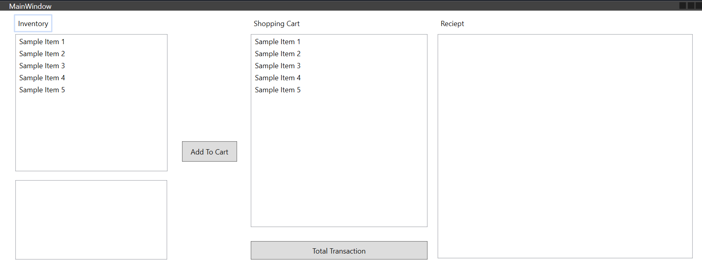

# Step 1 - Setting up the Project

1. Create a new Project with the name of GA_***YourName***_Classes
2. Replace the starter xaml with the following code, everything the the middle of the MainPage.xaml.

Start Xaml Code
```html
    <Canvas>
        <ListBox x:Name="lbInventory" Height="228" Width="253" d:ItemsSource="{d:SampleData ItemCount=5}" Canvas.Left="25" Canvas.Top="39" HorizontalAlignment="Left" VerticalAlignment="Center" />
        <RichTextBox Height="132" Width="252" Canvas.Left="25" Canvas.Top="282" HorizontalAlignment="Left" VerticalAlignment="Center">
            <FlowDocument>
                <Paragraph>
                    <Run x:Name="rtbItemDescription"/>
                </Paragraph>
            </FlowDocument>
        </RichTextBox>
        <Label Content="Inventory" Canvas.Left="25" Canvas.Top="8"/>
        <Button x:Name="btnAddToCart" Content="Add To Cart" Canvas.Left="302" Canvas.Top="217" Height="34" Width="91" HorizontalAlignment="Left" VerticalAlignment="Center" />
        <ListBox x:Name="lbShopping" Height="321" Width="293" d:ItemsSource="{d:SampleData ItemCount=5}" Canvas.Left="416" Canvas.Top="39" HorizontalAlignment="Center" VerticalAlignment="Top"/>
        <RichTextBox Height="373" Width="423" Canvas.Left="726" Canvas.Top="39" HorizontalAlignment="Left" VerticalAlignment="Center">
            <FlowDocument>
                <Paragraph>
                    <Run x:Name="rtbReciept" />
                </Paragraph>
            </FlowDocument>
        </RichTextBox>
        <Label Content="Shopping Cart" Canvas.Left="416" Canvas.Top="8" HorizontalAlignment="Left" VerticalAlignment="Center"/>
        <Label Content="Reciept" Canvas.Left="726" Canvas.Top="8" HorizontalAlignment="Left" VerticalAlignment="Center"/>
        <Button x:Name="btnTotalTransaction" Content="Total Transaction" Canvas.Left="416" Canvas.Top="383" HorizontalAlignment="Center" VerticalAlignment="Top" Width="293" Height="31"  />

    </Canvas>

```

You Will need to resize the MainWindow. Click on the top black bar, and then drag the right side over to cover the full layout.

***Final Result***


3. There are 3 controls that need to have events attached.
    1. `btnTotalTransaction` - Click Event
    2. `btnAddToCart` - Click Event
    3. `lbInventory` - Selection Changed Event

`code`
```csharp
    private void lbInventory_SelectionChanged(object sender, SelectionChangedEventArgs e)
    {
    
    } // lbInventory_SelectionChanged

    private void btnAddToCart_Click(object sender, RoutedEventArgs e)
    {
 

    } // btnAddToCart_Click

    private void btnTotalTransaction_Click(object sender, RoutedEventArgs e)
    {

    } // btnTotalTransaction_Click
```

## Click Here for [Step2 - Item Class](Step2_ItemClass.md)