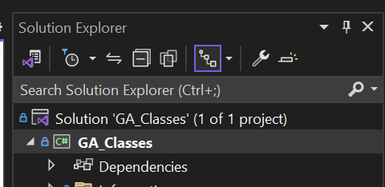

# Step 2 - Item Class

In this step we are going to create our class, `Item`. This is going to represent an item in a grocery store. 

---
## Creating The Item Class

1. In the Solution Explorer, right click the `.csproj` file. This is the second file in the solution explorer, it has a green icon and is given the same name as our project.



2. In the menu, hover over ***Add*** and then ***Class***. A prompt to name your new class shows up.

> Always name your class with an upper case letter, and singular  
>  * Good: Item  
>  * Bad: item  
>  * Bad: Items

3. Name your project `Item`.

You should have a new file called `Item.cs` in your solution explorer. Open it.

`Item Class`
```csharp
internal class Item {

}

```

4. In your item class, change the access modifier at the top from ***`internal`*** to ***`public`***

`Item Class`
```csharp
public class Item {

}
```


---

## Adding Fields
[Fields](../Information/Fields.md)

Fields represent the data associated with our object. They are the same as the variable we have been using, but all related to our one object.

> For our Item, were treating it as if it's a grocery story item. And potentially for our online store. Becuase of this we are creating 4 seperate fields.
> * Name - The name of our product
> * Description - The short description of our product
> * Price - The Current Price of our Product
> * Discount - The discount in percentage for our product

1. Add the following fields to the inside of your `Item` class.

While you could have fields be public, we tend to keep them private for security reasons. We will create properties further down to allow access.

Field names also tend to start with an underscore, _. This is a naming convention. It won't break the code, but it's commonly used, and easily allows us to see when a variable is a field.

Ex. `string _name;`

`Fields`
```csharp

    // Fields
    string _name;
    string _description;
    double _price;
    double _discount;

```

## Adding a Constructor
[Constructor](../Information/Constructor.md)

A Constructor lets us define the Data required for someone to create a new instance of our object ( Check out the Constructor page for more detail ).

We are going to create 2 Constructors, one that takes arguments for all 4 fields, and one that takes 2 arguments, one for name and one for price.

> Default Constructor: By default a class comes with a default constructor, `Item()`. This takes no arguments. By creating your own constructor, like we are here, it automatically gets rid of the default constructor.   
    Ex. `new Item();` <--- Will give an error.  
    You can always create your own default constructor by defining public `Item()` in your class.


To create a constructor the format is  
> Access Modifier - Class Name - Parameters  

> For our class it will be `public Item(string name, string description, double price, double discount) { }`

1. To create a constructor inside of our Item class we add the following code.

```csharp
    // Constructor
    public Item(string name, string description, double price, double discount)
    {
        // Field = argument
        _name = name;
        _description = description;
        _price = price;
        _discount = discount;

    } // Item
```

The field names ( indicated by the underscore, _ ) are being assigned the values passed in as arguments.

Field = Argument : `_name = name;`

> This constructor now prevents someone from creating a new instance with no data.  

```csharp
Item apple = new Item(); // Throws Errors
Item apple = new Item("Apple", "Red Delicious", 1.50, .1); // No Errors
```

We are now going to ***Add Another Constructor***.

> Overload: Creating multiple methods (or constructors) with the same name but different types of parameters is called ***overloading.***

2. Create another constructor that takes a name and price paremeter, but sets the description to "", and discount to 0.

`Constructors`
```csharp

    // Take a name, and a price
    public Item(string name, double price)
    {
        _name = name;
        _price = price;          
        _description = "";
        _discount = 0;
    }

```

But offering multiple constructors, we give different options to the user. We may not require a description and discount when adding a new `Item` so we create a constructor that can just take those two arguments.

***Result***  
You now have two options for Constructors when creating a `new Item()`.

```csharp
    Item apple = new Item("Apple", "Granny Smith", 2.00, .2);
        // Name = Apple
        // Desc = Granny Smith
        // Price = 2.00
        // Discount = .2

    Item fudge = new Item("Fudge", 3.00);
        // Name = Fudge
        // Desc = ""
        // Price = 3.00
        // Discount = 0
```


---

`Properties`
```csharp
    // Parameters
    // Get and Set
    // access modifer - Return Type - Name ( Same as the Field )
    // DOES NOT TAKE PARAMETERS
    public string Name
    {
        // key word get
        get // Give Permission to READ Data
        {
            return _name; // Return the field
        }
        set
        {
            _name = value;
        }

        // keyword set AND value


        // key word set
    } // Name

    // Apple.Name = "Red and Delicious"
    // .Name = value

    public string Description
    {
        get
        {
            return _description;
        }
        set => _description = value;
    }

    // Create the property for PRice, double
    public double Price
    {
        get
        {
            return _price;
        }
        set
        {
            // Prevent a negative number from being ASSIGNED to an item
            if(value >= 0)
            {
                _price = value;
            }        

        }


    } // Price

    public double Discount
    {
        // Lambda
        get => _discount;

        set
        {
            // -2000 
            // 0 --------------------- 1
            if(value >= 0 && value <= 1)
            {
                _discount = value;
            }

        }
    }
```

`Methods`
```csharp
    // Class Method
    public double DiscountedAmount()
    {
        return Price * Discount;
    }

    public double CalculateTotalPrice()
    {
        return Price - DiscountedAmount();
    }
```

`override ToString()`
```csharp
    // OVERRIDE ToString()
    public override string ToString()
    {
        // Name: Granny Smith - Price: $1.50 - Discount: $0.15 - Total Price: $1.35
        return $"Name: {_name} - Price: {_price.ToString("c")} - Discount:  {DiscountedAmount().ToString("c")} - Total Price: {CalculateTotalPrice().ToString("c")}";
    } // ToString()
```


---
## Finished Code

```csharp
    public class Item
    {

        // Fields
        string _name;
        string _description;
        double _price;
        double _discount;

        // Constructor
        // Access Modifer - SAME EXACT NAME AS THE CLASS - Take Paremeters

        
        public Item(string name, string description, double price, double discount)
        {
            // Field = argument
            _name = name;
            _description = description;
            Price = price;
            Discount = discount;

        } // Item

        // new Item("Fudge", -2000);
        // Take a name, and a price
        public Item(string name, double price)
        {
            _name = name;
            Price = price;          
            _description = "";
            Discount = 0;
        }

        // Overloading A Constructor
        // Overload a method - You are creating a method that has the same NAME as another method, but different paremeters. That does the same thing but with different data. 

        // Properties
        // Get and Set
        // access modifer - Return Type - Name ( Same as the Field )
        // DOES NOT TAKE PARAMETERS
        public string Name
        {
            // key word get
            get // Give Permission to READ Data
            {
                return _name; // Return the field
            }
            set
            {
                _name = value;
            }

            // keyword set AND value


            // key word set
        } // Name

        // Apple.Name = "Red and Delicious"
        // .Name = value

        public string Description
        {
            get
            {
                return _description;
            }
            set => _description = value;
        }

        // Create the property for PRice, double
        public double Price
        {
            get
            {
                return _price;
            }
            set
            {
                // Prevent a negative number from being ASSIGNED to an item
                if(value >= 0)
                {
                    _price = value;
                }        

            }


        } // Price

        public double Discount
        {
            // Lambda
            get => _discount;

            set
            {
                // -2000 
                // 0 --------------------- 1
                if(value >= 0 && value <= 1)
                {
                    _discount = value;
                }

            }
        }

        // Class Method
        public double DiscountedAmount()
        {
            return Price * Discount;
        }

        public double CalculateTotalPrice()
        {
            return Price - DiscountedAmount();
        }

        // OVERRIDE ToString()
        public override string ToString()
        {
            // Name: Granny Smith - Price: $1.50 - Discount: $0.15 - Total Price: $1.35
            return $"Name: {_name} - Price: {_price.ToString("c")} - Discount:  {DiscountedAmount().ToString("c")} - Total Price: {CalculateTotalPrice().ToString("c")}";
        } // ToString()
}
```