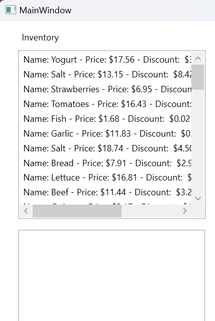
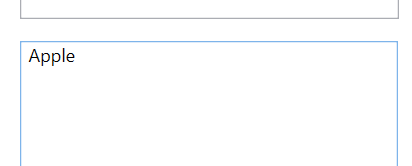
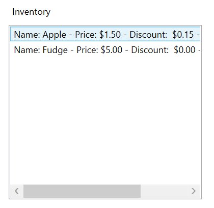
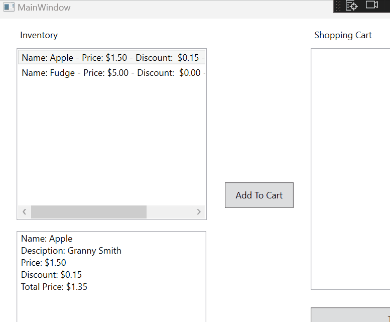
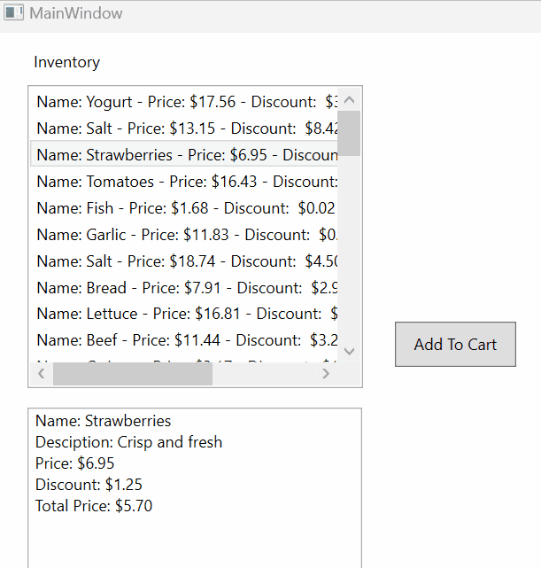

# Step 3 - Display A List Of Item

Now we're going back to our `MainWindow.xaml` and `MainWindow.xaml.cs` and use our new `Item` class we constructed to display an inventory. 




## 1. Create a new Item in MainWindow()

1. Lets start off by testing out our our new class. In the `MainWindow()` method, lets create a `new Item`.

```csharp

	public MainWindow() {
		
		InitialComponent();
	
		// When we create a class, it's like a "blueprint" for objects we can create in code.
		// We do this by creating an "instance" of our Item object
		// Make sure to use the new keyword

		Item apple = new Item("Apple", "Granny Smith", 1.50, .1);
		// This creates an "instance" of our "Item" that stores information about a "Granny Smith Apple"

		// And lets test it by displaying the value from our apple.Name
		rtbItemDescription.Text = apple.Name;

	}

```

`Run your code`  


If it works properly, you should see the name you passed into your item. 

## 2. Test your new Item() and display the text to our Rich Text Box
2. Now that this is working, lets make it look a little cleaner. Let's format our code so it displays all the information clearly.

> Name: Apple  
> Desciption: Granny Smith  
> Price: $1.50  
> Discount: $0.15  
> Total Price: $1.35  

`MainWindow()`
```csharp
public MainWindow()
{
    Item apple = new Item("Apple", "Granny Smith", 1.50, .1);
            
    // Clear RichTextBox
    rtbItemDescription.Text = "";

	// Formatting our Code
    rtbItemDescription.Text += $"Name: {apple.Name}\n";
    rtbItemDescription.Text += $"Desciption: {apple.Description}\n";
    rtbItemDescription.Text += $"Price: {apple.Price.ToString("c")}\n";
    rtbItemDescription.Text += $"Discount: {apple.DiscountedAmount().ToString("c")}\n";
    rtbItemDescription.Text += $"Total Price: {apple.CalculateTotalPrice().ToString("c")}\n";
    }
```

Here we have formatted the code so it's easier to read. But this is all in main. For now, lets relocate all this code to our `SelectionChangeEvent`

```csharp
 private void lbInventory_SelectionChanged(object sender, SelectionChangedEventArgs e)
    {
        Item apple = new Item("Apple", "Granny Smith", 1.50, .1);
            
        // Clear RichTextBox
        rtbItemDescription.Text = "";

        rtbItemDescription.Text += $"Name: {apple.Name}\n";
        rtbItemDescription.Text += $"Desciption: {apple.Description}\n";
        rtbItemDescription.Text += $"Price: {apple.Price.ToString("c")}\n";
        rtbItemDescription.Text += $"Discount: {apple.DiscountedAmount().ToString("c")}\n";
        rtbItemDescription.Text += $"Total Price: {apple.CalculateTotalPrice().ToString("c")}\n";

    } // lbInventory_SelectionChanged

```

## Create a list of items

1. Globally delcare a list of Items in our `MainWindow.xaml.cs`

2. In your MainWindow() add two new Items to that list. And attach it to your `lbInventory.ItemsSource`.

```csharp
   public partial class MainWindow : Window
    {
        // Declare a list of Items
        List<Item> inventory;

        public MainWindow()
        {
            InitializeComponent();
            
            inventory = new List<Item>();
            inventory.Add(new Item("Apple", "Granny Smith", 1.50, .1));
            inventory.Add(new Item("Fudge", 5.00));
            lbInventory.ItemsSource = inventory;

```

You should see the following result when you run your app. You've now added two items to our inventory.



Now, let's give our app the ability to display information about the item we clicked on.

### 4. Display product information

To give our app the ability to display information we only need to tweak two lines of code in our `lbInventory_SelectionChanged` event.

1. Comment out your apple = new Item(....
2. Create a variable to hold the `selectedIndex`
3. Create a variable to how the reference to the selected item.
4. Change our formatted code to use that selected Item   

```csharp
 private void lbInventory_SelectionChanged(object sender, SelectionChangedEventArgs e)
    {
        // Remove / Comment this out
        // Item apple = new Item("Apple", "Granny Smith", 1.50, .1);
      
            int selectedIndex = lbInventory.SelectedIndex;
            Item selectedItem = inventory[selectedIndex];
            // Item SelectedItem = iventory0 = new Item("Yogurt", "Premium cut", 17.56, 0.2), 

            // Clear RichTextBox
            rtbItemDescription.Text = "";
            
            rtbItemDescription.Text += $"Name: {selectedItem.Name}\n";
            rtbItemDescription.Text += $"Desciption: {selectedItem.Description}\n";
            rtbItemDescription.Text += $"Price: {selectedItem.Price.ToString("c")}\n";
            rtbItemDescription.Text += $"Discount: {selectedItem.DiscountedAmount().ToString("c")}\n";
            rtbItemDescription.Text += $"Total Price: {selectedItem.CalculateTotalPrice().ToString("c")}\n";

    } // lbInventory_SelectionChanged

```

If this works properly, when you click on an item in the inventory, the information gets displayed in the rich text box.



### 5. Preload with a full inventory

Displaying two items is great, display 50 is a lot better. Copy and paste the following method into your `MainWindow.xaml.cs`.

Place it outside of any other methods, but inside the class.

```csharp
    public void PreloadInventory()
    {
        inventory = new List<Item>
    {
        new Item("Yogurt", "Premium cut", 17.56, 0.2), 
        new Item("Salt", "Soothing blend", 13.15, 0.64), 
        new Item("Strawberries", "Crisp and fresh", 6.95, 0.18),
        new Item("Tomatoes", "Local farm product", 16.43, 0.57),
        new Item("Fish", "Starchy and filling", 1.68, 0.01),
        new Item("Garlic", "Freshwater", 11.83, 0.08),
        new Item("Salt", "Balsamic", 18.74, 0.24),
        new Item("Bread", "Lean and healthy", 7.91, 0.37),
        new Item("Lettuce", "Ripe and juicy", 16.81, 0.82),
        new Item("Beef", "Vitamin-rich", 11.44, 0.28),
        new Item("Quinoa", "Free-range", 3.17, 0.53),
        new Item("Tofu", "Spicy and colorful", 13.63, 0.44),
        new Item("Herbs", "Steel-cut", 3.23, 0.78),
        new Item("Bread", "Vitamin-rich", 16.96, 0.7),
        new Item("Soda", "High-protein", 1.71, 0.56),
        new Item("Peppers", "Balsamic", 11.93, 0.05),
        new Item("Chicken", "Lean and healthy", 12.11, 0.54),
        new Item("Quinoa", "Low-calorie", 9.26, 0.16),
        new Item("Beef", "Organic and fresh", 4.27, 0.29),
        new Item("Cheese", "Seedless variety", 7.94, 0.35),
        new Item("Soda", "Seedless variety", 2.11, 0.22),
        new Item("Olive Oil", "Fruit spread", 8.35, 0.36),
        new Item("Oats", "Crunchy snack", 3.56, 0.08),
        new Item("Ginger", "Zesty", 4.71, 0.71),
        new Item("Bread", "Crisp and fresh", 10.76, 0.5),
        new Item("Nuts", "Fruit spread", 8.76, 0.97),
        new Item("Peppers", "Grass-fed beef", 15.47, 0.78),
        new Item("Tofu", "Sugar-free", 10.21, 0.72),
        new Item("Nuts", "Local farm product", 16.03, 0.42),
        new Item("Vinegar", "Maple-flavored", 11.46, 0.35),
        new Item("Potatoes", "Freshly ground", 13.6, 0.77),
        new Item("Oats", "Grass-fed beef", 10.05, 0.71),
        new Item("Coffee", "Sweet treat", 6.92, 0.08),
        new Item("Chocolate", "Assorted herbs", 3.88, 0.9),
        new Item("Candy", "Sugar-free", 1.04, 0.8),
        new Item("Soda", "Juicy and flavorful", 6.42, 0.93),
        new Item("Pasta", "Premium cut", 10.34, 0.48),
        new Item("Jam", "Crunchy snack", 7.38, 0.51),
        new Item("Beef", "100% natural", 5.52, 0.68),
        new Item("Chocolate", "Fresh and tasty", 13.71, 0.32),
        new Item("Butter", "Vitamin-rich", 8.63, 0.3),
        new Item("Ketchup", "Full of flavor", 17.83, 0.97),
        new Item("Banana", "Crunchy snack", 8.8, 0.49),
        new Item("Herbs", "Extra virgin", 17.56, 0.14),
        new Item("Pepper", "Full of flavor", 13.66, 1.0),
        new Item("Water", "Steel-cut", 2.0, 1.0),
        new Item("Pepper", "Sweet and crunchy", 13.68, 0.58),
        new Item("Cheese", "Seedless variety", 4.03, 0.87),
        new Item("Tea", "Full of flavor", 9.9, 0.72),
        new Item("Grapes", "Sweet treat", 19.73, 0.05)
    };
    } // PreloadInventory()
```

And now inside of our MainWidnow() method lets refactor some code.
Call our new method, PreloadInventory. It initalizes a new List<Item> and fills it with items. Just make sure your List<Item> is names `inventory`.

Then we attach to the ItemsSource. If everything works properly, you should now have a full inventory where you can see the item descriptions.

`MainWindow()`
```csharp
    public MainWindow()
    {
        InitializeComponent();
        PreloadInventory();

        // Add to lbInventory ItemsSource
        lbInventory.ItemsSource = inventory;

    } // MainWindow
```

***Result***  



# Next [Step4 Shopping Cart Class](Step4_ShoppingCartClass.md)

---

### Full Code

`public class MainWindow.xaml.cs`

```csharp
 public partial class MainWindow : Window
    {
        // Declare a list of Items
        List<Item> inventory;

        public MainWindow()
        {
            InitializeComponent();
            PreloadInventory();

            // Add to lbInventory ItemsSource
            lbInventory.ItemsSource = inventory;

        } // MainWindow

        private void lbInventory_SelectionChanged(object sender, SelectionChangedEventArgs e)
        {
            // I Am GRABBING the selected INDEX of the object
            int selectedIndex = lbInventory.SelectedIndex;
            Item selectedItem = inventory[selectedIndex];
            // Item SelectedItem = iventory0 = new Item("Yogurt", "Premium cut", 17.56, 0.2), 

            // Clear RichTextBox
            rtbItemDescription.Text = "";
            
            rtbItemDescription.Text += $"Name: {selectedItem.Name}\n";
            rtbItemDescription.Text += $"Desciption: {selectedItem.Description}\n";
            rtbItemDescription.Text += $"Price: {selectedItem.Price.ToString("c")}\n";
            rtbItemDescription.Text += $"Discount: {selectedItem.DiscountedAmount().ToString("c")}\n";
            rtbItemDescription.Text += $"Total Price: {selectedItem.CalculateTotalPrice().ToString("c")}\n";

        } // lbInventory_SelectionChanged

        private void btnAddToCart_Click(object sender, RoutedEventArgs e)
        {

        } // btnAddToCart_Click

        private void btnTotalTransaction_Click(object sender, RoutedEventArgs e)
        {

        } // btnTotalTransaction_Click

        // PreloadInventory

        public void PreloadInventory()
        {
            inventory = new List<Item>
        {
            new Item("Yogurt", "Premium cut", 17.56, 0.2), 
            new Item("Salt", "Soothing blend", 13.15, 0.64), 
            new Item("Strawberries", "Crisp and fresh", 6.95, 0.18),
            new Item("Tomatoes", "Local farm product", 16.43, 0.57),
            new Item("Fish", "Starchy and filling", 1.68, 0.01),
            new Item("Garlic", "Freshwater", 11.83, 0.08),
            new Item("Salt", "Balsamic", 18.74, 0.24),
            new Item("Bread", "Lean and healthy", 7.91, 0.37),
            new Item("Lettuce", "Ripe and juicy", 16.81, 0.82),
            new Item("Beef", "Vitamin-rich", 11.44, 0.28),
            new Item("Quinoa", "Free-range", 3.17, 0.53),
            new Item("Tofu", "Spicy and colorful", 13.63, 0.44),
            new Item("Herbs", "Steel-cut", 3.23, 0.78),
            new Item("Bread", "Vitamin-rich", 16.96, 0.7),
            new Item("Soda", "High-protein", 1.71, 0.56),
            new Item("Peppers", "Balsamic", 11.93, 0.05),
            new Item("Chicken", "Lean and healthy", 12.11, 0.54),
            new Item("Quinoa", "Low-calorie", 9.26, 0.16),
            new Item("Beef", "Organic and fresh", 4.27, 0.29),
            new Item("Cheese", "Seedless variety", 7.94, 0.35),
            new Item("Soda", "Seedless variety", 2.11, 0.22),
            new Item("Olive Oil", "Fruit spread", 8.35, 0.36),
            new Item("Oats", "Crunchy snack", 3.56, 0.08),
            new Item("Ginger", "Zesty", 4.71, 0.71),
            new Item("Bread", "Crisp and fresh", 10.76, 0.5),
            new Item("Nuts", "Fruit spread", 8.76, 0.97),
            new Item("Peppers", "Grass-fed beef", 15.47, 0.78),
            new Item("Tofu", "Sugar-free", 10.21, 0.72),
            new Item("Nuts", "Local farm product", 16.03, 0.42),
            new Item("Vinegar", "Maple-flavored", 11.46, 0.35),
            new Item("Potatoes", "Freshly ground", 13.6, 0.77),
            new Item("Oats", "Grass-fed beef", 10.05, 0.71),
            new Item("Coffee", "Sweet treat", 6.92, 0.08),
            new Item("Chocolate", "Assorted herbs", 3.88, 0.9),
            new Item("Candy", "Sugar-free", 1.04, 0.8),
            new Item("Soda", "Juicy and flavorful", 6.42, 0.93),
            new Item("Pasta", "Premium cut", 10.34, 0.48),
            new Item("Jam", "Crunchy snack", 7.38, 0.51),
            new Item("Beef", "100% natural", 5.52, 0.68),
            new Item("Chocolate", "Fresh and tasty", 13.71, 0.32),
            new Item("Butter", "Vitamin-rich", 8.63, 0.3),
            new Item("Ketchup", "Full of flavor", 17.83, 0.97),
            new Item("Banana", "Crunchy snack", 8.8, 0.49),
            new Item("Herbs", "Extra virgin", 17.56, 0.14),
            new Item("Pepper", "Full of flavor", 13.66, 1.0),
            new Item("Water", "Steel-cut", 2.0, 1.0),
            new Item("Pepper", "Sweet and crunchy", 13.68, 0.58),
            new Item("Cheese", "Seedless variety", 4.03, 0.87),
            new Item("Tea", "Full of flavor", 9.9, 0.72),
            new Item("Grapes", "Sweet treat", 19.73, 0.05)
        };
        } // PreloadInventory()


    } // class

```