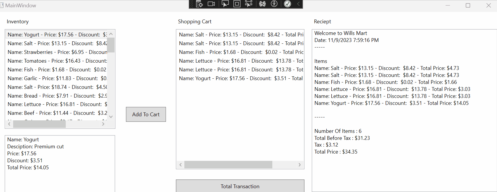

# Step 5 - Displaying Our Receipt

With our final step, were going to 
* Add a single instance of a `ShoppingCart`
* Add the ability to add the selected item from our Inventory to our shopping chart
* Display the total price.

1. In the `MainWindow.xaml.cs` let's add a 
    a. ShoppingCart object globally. 
    b. Initialize the ShoppingCart item in the MainWindow(), and 
    c. Then attach the List Of Items in the cart to our final ListBox.

	```csharp
    	
        public partial class MainWindow : Window
    {
        // Declare a list of Items
        List<Item> inventory;

        // a. And a Shopping Cart Object
        ShoppingCart cart;

        public MainWindow()
        {
            InitializeComponent();
            PreloadInventory();

            // Add to lbInventory ItemsSource
            lbInventory.ItemsSource = inventory;

            // b. Create The New Instance of ShoppingCart
            cart = new ShoppingCart("Wills Mart");

            // c. Attach our `cart.ItemsInCart` to our `lbShopping.ItemsSource`
            lbShopping.ItemsSource = cart.ItemsInCart;


        } // MainWindow
	```

    You won't see any different yet. But after the next step, you'll be able to add items to the shopping cart.

2. Inside our `btnAddToCart_Click` event, we want to add the following code.

    a. Similar to the "Display Info" event, we start by grabbing the selected index of the `lbInventory`
    b. Next we declare a variable to reference that `Item`.
    c. Then we call our `ShoppingCart` instance, `cart`, and add our `selectedItem` to it.
    d. Refresh the Items list inside the `lbShopping` items list. This will refresh the list box so you see the new items added. `lbShopping.Items.Refresh()`

> Whats happening here is when you create a `new` instance of an item, it stores it in the memory called the **Heap**. Any time we assign it to another variable they are looking at the SAME place in memory. This is called ***By Reference***

> * Item apple = new Item("Apple", 1.50);  
> * inventory.Add(apple); // Index 0  
> * cart.AddItem(inventory[0]); // Index 0  
> * // cart[0].Name // Name is apple  
> * 1 item, same item, passed into each object  

```csharp
    private void btnAddToCart_Click(object sender, RoutedEventArgs e)
    {
        // a. Grab the selected Index
        int selectedIndex = lbInventory.SelectedIndex;
        // b. Reference the selected Item
        Item selectedItem = inventory[selectedIndex];

        // c. Add the item to our cart
        cart.AddItem(selectedItem);

        // d. Refresh Cart Display
        lbShopping.Items.Refresh();

    } // btnAddToCart_Click
```

We can now add items to our shopping cart!


## Final Step - Displaying the Transaction 

And our final method, because we have built our `ShoppingCart` class to do all of our calculations and print the receipt, it is very simple.

In our final click event, `btnTotalTransaction_Click` simply call the `cart.Receipt()` method, which returns a fully formatted receipt, and assign it to our `rtbReceipt.Text` rich text box.

```csharp
    private void btnTotalTransaction_Click(object sender, RoutedEventArgs e)
    {
        rtbReceipt.Text = cart.Receipt();
    } // btnTotalTransaction_Click
```



---

## And that's it!

You have now learned
1. How to create classes
    1. What fields
    2. Constructors
    3. Properties
    4. and Methods are
2. The basics on how to override a method.
3. Passing by reference
4. Creating a List of your own object
5. How to pass a reference of an object from one list to another
6. How to interact with Objects inside of objects.

Congratulations!! This is a large part of your time as a programmer. Start looking at the world as objects you can construct in code, and you'll be well on your way to being an engineer.

